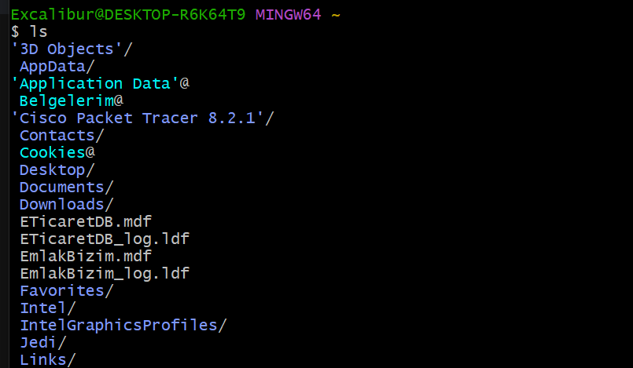
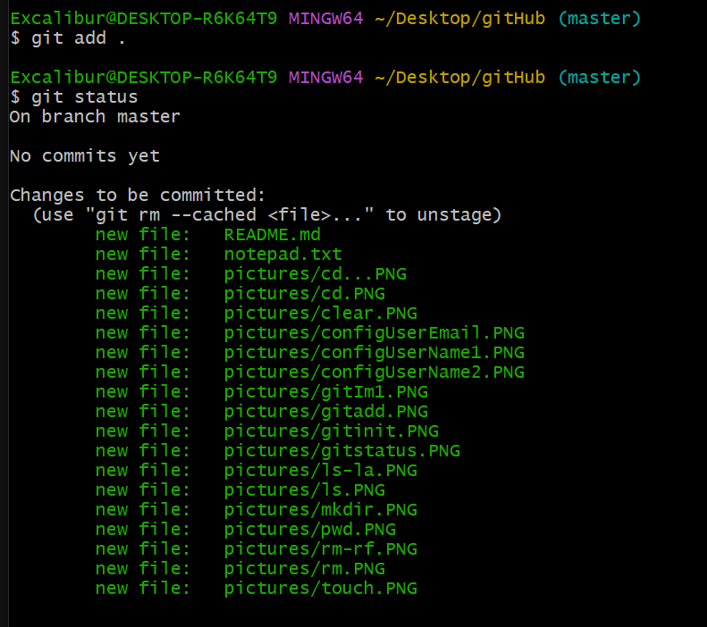
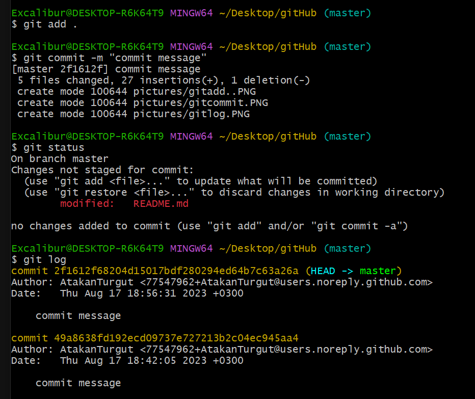
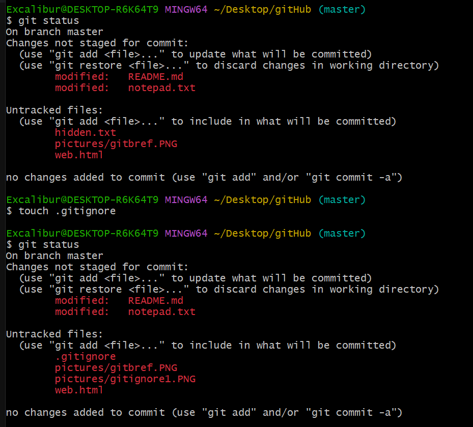
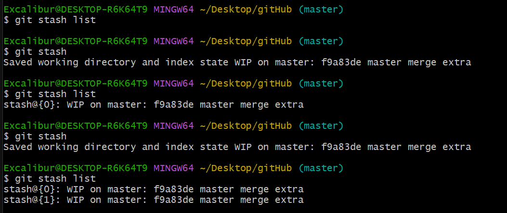
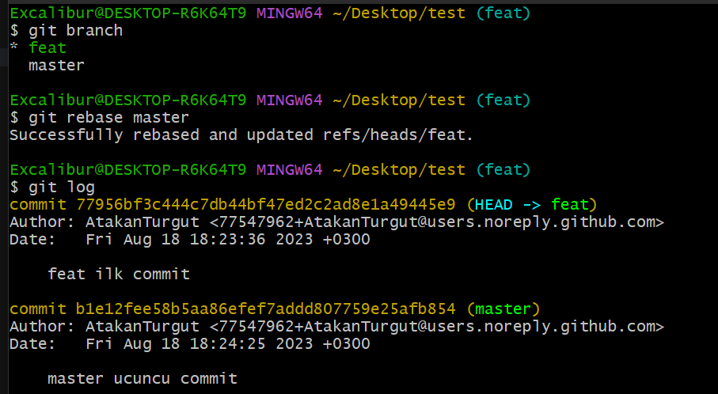

# Git & GitHub : Version Control
Git : It is a Version Control System.

### [Git Installation for Windows](#)
[[Source]](https://git-scm.com/download/win) for installing Git on Windows.       <br/>
You can skip using the presets by clicking the `Next` button. Finally, you can start the installation by pressing the `Install` button and after the installation you can close the installation with the `Finish` button.
```bash
        git --version
```
After successfully completing the installation, you can check the Git version using the code above.  <br/>
After installation you can type commands in the `Git Bash` command processor.


### [Git Installation for Mac and Linux](#)
Mac and Linux systems already have Git installed. <br/>
If it is not installed on the system and you need to install it [[source]](https://git-scm.com/download).   <br/>
Git can be installed using the Binary Installer.
```bash
        git --version 
```     

Using the above command you can see if Git is running or not.
```bash
        git
```
If Git is installed, you can access Git Documentation by entering the above command.

### [Git Bash - Terminal Usage](#)
Git commands for Windows, Mac and Linux are no different, they are the same.

- Shows other folders and documents in the current directory.

```bash
        ls      
```


- If you want to see the hidden files in the folder:

```bash
        ls -la      
```


- To review the directory you are in:

```bash
        pwd
```


- To access other folders in the directory:

```bash
        cd FileName
```


- To go to the previous directory:

```bash
        cd ..
```


- To clear terminal outputs:

```bash
        clear
```

- To create a folder in a directory:

```bash
        mkdir FileName
```


- To create a file in the directory:

```bash
        touch file.extention
```
 

 - To remove files from the directory:

```bash
        rm file.extention
```
 

- To remove a folder from the directory:

```bash
        rm -rf FileName
```
 

- If you come across a long list that continues, you can move it up or down with the `arrow keys` from the keyboard.
- To exit the list, `'q'` keys must be pressed on the keyboard.

 

### [Entering Username and Email](#)
- To save your Git username and email information:

```bash
        git config --global user.name "UserName Surname"

        git config user.name
```
 
 

- To save email information to the Git system:

```bash
        git config --global user.email user@email.com

        git config user.email
```
 

### [Git Basic Commands](#)
```c
        Work Folder      =>      Index - Staging       =>       Local Repository
                          git add                      git commit
```

- To show the current state of Git:

```bash
        git status
```
It's always correct to check git status before running `git init` anywhere. <br/>
Otherwise, several different activations of git may cause conflicts.
 

 - To enable Git in the folder:     runs as master or master branch.

```bash
        git init
```
 

 - To add files or folders to Git:

```bash
        git add file.extention
```
 

- To add it to Git:

```bash
        git add .
```
 

- To add commits to Git:

```bash
        git commit -m "commit message"
```
- The processing message should be descriptive of what has been done.

 

 - To view transactions:

```bash
        git log
```
Each commit has its own transaction number. <br/>
It is used for this purpose when it is desired to go to the processing center.

        HEAD -> master

Shows the current branch.


- To re-introduce what's been done in Git and re-enable the controls, briefly:

```bash
        git add .
        git commit -m "commit message"
        git status
        git log
```


We don't want to save the files you don't want to share in `Local Repo`.
- `git add` needs to be done..
- First you need to create a file named `.gitignore`.

```bash
        touch .gitignore
```
gitignore file, you must write the file that you want to be hidden with its extension.
Incognito file is no longer protected by Git.
```c
        .gitignore  ==>  file.extention
```



### [Branch Transactions](#)

        HEAD -> master

MASTER : Usually used as main branch. Represents the finished final version of a project.
HEAD -> Branch : It shows in which places (branch) it is in your git. It usually shows the last commit.
- To view available branches:

```bash
        git branch 
```


- To create a new branch:

```bash
        git branch BranchName 
```


- To switch to another branch:

```bash
        git switch BranchName 
```


- To merge two branches:
you must be on the branch you will merge with.

```bash
        git branch master
        git merge BranchtoMerge
```
```c
        master  <--  BranchtoMerge
        BranchtoMerge is added to the master Branch.
```


### [Fast Forwarding](#)
It is the process of merging (merge) with the last Master branch by advancing with another branch without making any changes on the Master branch.


### [Merge Conflict](#)
You can resolve Merge Conflict transactions in commit in Master Branch.


### [Stash](#)
If a file that occurred in another branch was added to git without committing (git add <>) and then moved to another branch again, the file that occurred in the other branch should also be moved to the previous branch.  <br/>
In order to prevent this situation, you need to keep the cards hidden in your branch. You use the following code:

```bash
        git stash 
```


- After completing the work in the other branch, you can access the commands you have stored in your own branch with the following code.

```bash
        git stash pop
```


- To view the stored data:

```bash
        git stash list
```


- To process the `stash` you want:

```bash
        git stash apply stash@{i}
```
Even if you hold Stash again, it will still be stored for reuse.


- To clear all existing stored Stashes from the list:

```bash
        git stash clear
```


- If the file you are working with is somehow corrupted or causing trouble after committing, you can fix it by using the following command to revert it to its previous commit:

```bash
        git restore file.extention
```


### [Checkout](#)
- To navigate between your committees:

```bash
        git checkout reachedCommitId
```
Detached HEAD : 


- After executing the operations, a separate branch can be created and continued, or the easiest way to return to the working branch after the notes to be taken are taken:

```bash
        git switch master
```


### [Reset and Revert](#)
- Switch to a past commit, removing all previous commits - Changes in commits are not deleted:

```bash
        git reset reachedCommitId
```


- To go back to a past commit and remove all previous commits and transactions:

```bash
        git reset --hard reachedCommitId
```


- To go back to a past commit and create a new commit without deleting previous commits, you can continue on the same branch:

```bash
        git revert reachedCommitId
```


With the `git diff` certificate you can protect or see the differences between two files.
- To see what changes there are with the last `commit` or another `commit`:

```bash
        git diff
```


```bash
        git diff reachedCommitId
```


- To see what kind of changes there are between transition `branch` and other `branch`:

```bash
        git diff BranchName
```


- To see what kind of changes there are between two different `branch`:

```bash
        git diff firstBranchName secondBranchName 
```


- `git rebase` can be used both to clean the log and to rewrite history.
You can also use it if you want to move the changes from the `master branch` to your own branch.
No extra `merge commit` will be done and the logs will be cleaned and sorted.
!! No other teammate should be working on the `master branch`. 
!! The important thing is to be in a branch other than the `master` branch.
```bash
        git rebase master
```


### [GitHub](#)
GitHub is a web-based storage service for software development projects that use Git as their version control system. <br/>
It allows you to store the documentation you have made by using Git commands, allowing you to access them in a shared way later. <br/>
Before uploading to GitHub, you need to create a `New repository` in GitHub by clicking `Repositories > New` or by clicking the `+` icon next to the search bar and clicking `New repository`. You can add a name (Repository name*) and optionally a description (Description (optional)) to your repo. <br/>
The `Public` option must be selected if you want other users to see your Repo. <br/>
You can choose the `Private` option if you want only me to see it and not other users. <br/>

- To enable it to connect remotely to your GitHub:
- In `origin` it holds the URL of the Repository.

```bash
        git remote add origin https://github.com/UserName/GitRepoName.git
```


- To be able to post commits to your Remote Repo:
!! On the branch, the branch should be the `main branch` (whichever your main branch is) and you should perform the operations in that main branch.      <br/>
!! Your GitHub account must be signed in to Git before doing these operations.  <br/>
`-u` holds that it will push to `origin` and `main`.    
```bash
        git push -u origin main

        git push origin main
        git push                        -> origin -> main
```


- To view `remote branches`:

```bash
        git branch -r
```


Pull Request : GitHub can have us `merge` if there is no conflict between branches.
- To move changes from GitHub to your `Local Repository`:

```bash
        git fetch origin BranchName
```

- To add changes from Github and save changes over your own branch without creating a separate branch:

        git pull = git fetch + git merge

```bash
        git pull 
```

- To add a Repo from someone else's GitHub to your Local Repo:

```bash
        git clone https://github.com/AtakanTurgut/DataStructures_Advanced
```


- By Forking, you can add other users Repos as Repo to your own account.
- Then you can see it in your `Local Repo` using `git clone` command from your Repo.

To add developers to a Private Repo:

        RepoName       ->      Collaborators        ->         Add peope