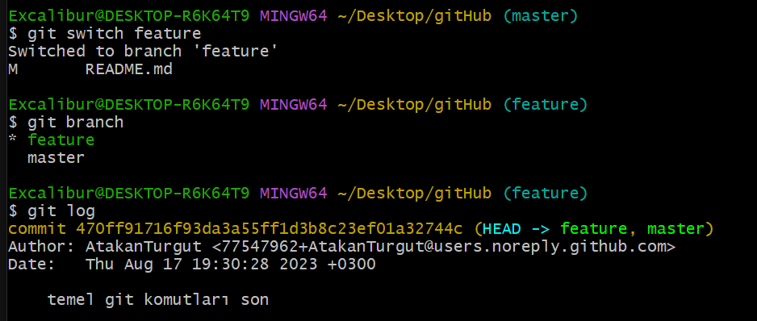
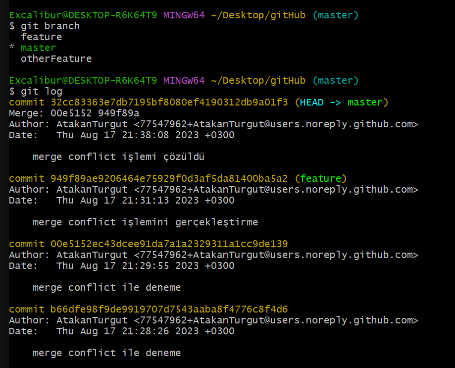
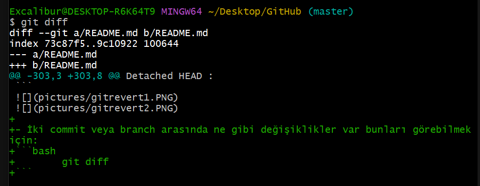
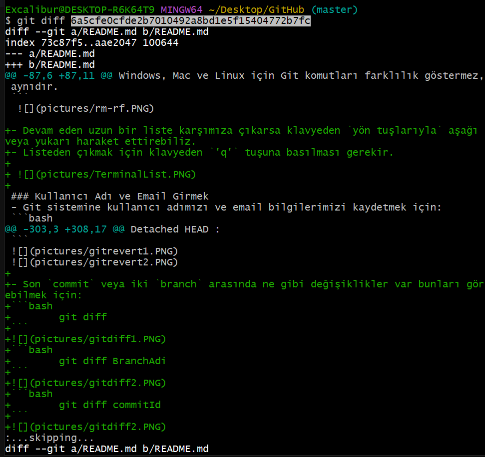
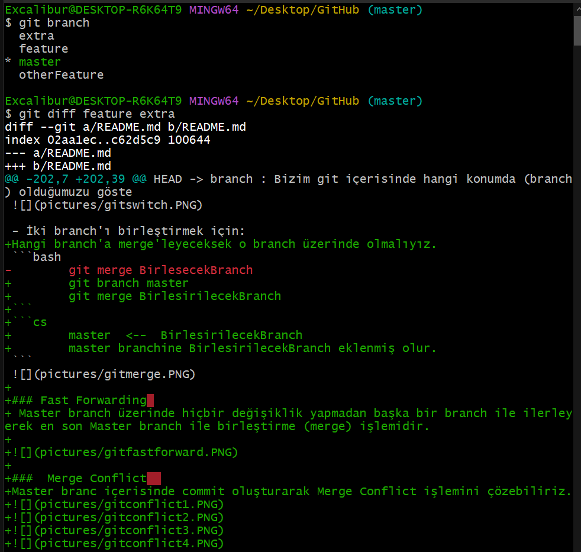
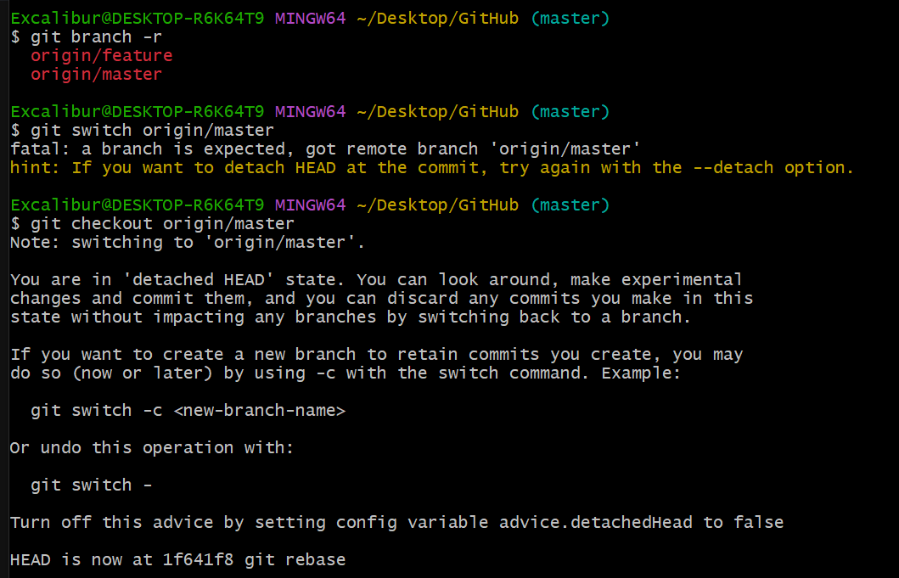

# Git & GitHub : Versiyon Kontrolü
Git : Versiyon Kontrol Sistemidir.

### [Windows Git Kurulum](#)
Windows'a Git'i kurmak için [[kaynak]](https://git-scm.com/download/win).       <br/>
Hazır ayarlar kullanılarak `Next` butonuna tıklayıp geçebilirsiniz. En son `Install` seçeneğine tıklayarak yüklemeyi başlatıp yüklendikten sonra da `Finish` butonuna tıklayarak kapatabilirsiniz.
```bash
        git --version
```
Yükleme işlemi başarıyla sona erdikten sonra yukarıdaki komutu kullanarak Git versiyonunun kontrol edebilisiniz.  <br/>
Komutları yükleme sonrası `Git Bash` komut iştemcisine yazabilirsiniz.


### [Mac ve Linux Kurulumu](#)
Mac ve Linux sistemlerde hali hazırda Git kurulu olur.  <br/>
Eğer sistemde yüklü değilse ve yüklemeniz gerekirse [[kaynak]](https://git-scm.com/download).   <br/>
Binary installer'ı kullanarak Git yüklenebilir.
```bash
        git --version 
```     

Yukarıdaki komutu kullanarak Git'in çalışıp çalışmadığını görebilirsiniz.
```bash
        git
```
Git yüklüyse yukarıdaki komutu girerek Git Dokümantasyonuna ulaşabilisiniz.

### [Git Bash - Terminal Kullanımı](#)
Windows, Mac ve Linux için Git komutları farklılık göstermez, aynıdır.

- İçerisinde bulunduğunuz dizinde diğer klasörleri ve dokümanları gösterir.

```bash
        ls      
```


- Klasör içerisindeki gizli dosyaları da görmek isterseniz:

```bash
        ls -la      
```


- Üzerinde bulunduğunuz dizini bulmak için:

```bash
        pwd
```


- Dizindeki diğer klasörlere ulaşabilmek için:

```bash
        cd KlasorAdi
```


- Bir önceki dizine geri dönebilmek için:

```bash
        cd ..
```


- Terminal çıktılarını temizlemek için:

```bash
        clear
```

- Dizin üzerinde klasör oluşturmak için:

```bash
        mkdir KlasorAdi
```


- Dizinde dosya oluşturmak için:

 ```bash
        touch dosya.uzantısı
 ```
 

 - Dizinden dosya kaldırmak için:

```bash
        rm dosya.uzantısı
 ```
 

- Dizinden klasör kaldırmak için:

```bash
        rm -rf KlasorAdi
```
 

- Devam eden uzun bir liste karşınıza çıkarsa klavyeden `yön tuşlarıyla` aşağı veya yukarı haraket ettirebiliz.
- Listeden çıkmak için klavyeden `'q'` tuşuna basılması gerekir.

 

### [Kullanıcı Adı ve Email Girmek](#)
- Git sistemine kullanıcı adınızı ve email bilgilerinizi kaydetmek için:

```bash
        git config --global user.name "UserName Surname"

        git config user.name
```
 
 

- Git sistemine email bilgisini kaydetmek için:

```bash
        git config --global user.email user@email.com

        git config user.email
```
 

### [Git Temel Komutları](#)
```c
        Çalışma Klasörü      =>      Index - Staging       =>       Local Repository
                          git add                      git commit
```

- Git güncel durumunu göstermek için:

```bash
        git status
```
Herhangi bir yerde `git init` komutunu çalıştırmadan önce git durumunu kontrol etmek her zaman için doğru olacaktır. <br/>
Aksi halde git'i birkaç farklı aktif etme durumu çakışmalara sebep olabilir.
 

 - Git'i klasörde aktif etmek için:     master veya main branch olarak çalıştırır.

 ```bash
        git init
```
 

 - Git'e dosya veya klasör eklemek için:

```bash
        git add dosya.uzantısı
```
 

- Git'e yapılanların tümünü eklemek için:

```bash
        git add .
```
 

- Git'e eklenenlerin işlenebilmesi için:

```bash
        git commit -m "commit message"
```
- İşleme alma mesajı yapılanları açıklayıcı olmalıdır.

 

 - İşlemleri görebilmek için:

 ```bash
        git log
```
Her commit'in kendine ait bir işlem numarası olur. <br/>
İşlem numarasına dönmek isterseniz o amaçla kullanılır.

        HEAD -> master

Üzerinde bulunduğunuz branch'ı gösterir


- Yapılan değişiklikleri tekrardan Git'e eklemek ve kontrolleri tekrardan sağlamak için kısaca:

```bash
        git add .
        git commit -m "commit message"
        git status
        git log
```


Gizli kalmasını istediğimiz dosyaları `Local Repo`'ya kaydetmek istemeyiz.
- `git add` yapılmaması gerekir.
- Öncelikle `.gitignore` isimli bir dosya oluşturmalısınız.

```bash
        touch .gitignore
```
gitignore dosyası içerisine gizli kalmasını istediğiniz dosyayı uzantısıyla birlikte yazmalısınız.
Gizli kalmasını istediğiniz dosya artık Git sorumluluğuna girmez.
```c
        .gitignore  ==>  dosya.uzantısı
```


### [Branch İşlemleri](#)

        HEAD -> master

MASTER : Genellikle ana branch olarak kullanılır. Bir projenin bitmiş son halini temsil eder.
HEAD -> branch : Sizin git içerisinde hangi konumda (branch) olduğunuzu gösterir. Genellikle son commit'i gösterir.
- Var olan branch'leri görüntülemek için:

```bash
        git branch 
```


- Başka bir branch oluşturmak için:

```bash
        git branch BranchAdi 
```


- Başka bir branch'a geçiş yapmak için:

```bash
        git switch BranchAdi 
```


- İki branch'ı birleştirmek için:
Hangi branch'a merge'leyecekseniz o branch üzerinde olmalısınız.

```bash
        git branch master
        git merge BirlesirilecekBranch
```
```c
        master  <--  BirlesirilecekBranch
        master branchine BirlesirilecekBranch eklenmiş olur.
```


### [Fast Forwarding](#)
 Master branch üzerinde hiçbir değişiklik yapmadan başka bir branch ile ilerleyerek en son Master branch ile birleştirme (merge) işlemidir.


### [Merge Conflict](#)
Master branch içerisinde commit oluşturarak Merge Conflict işlemini çözebilirsiniz.




### [Stash](#)
Başka bir branch'da oluşturulan bir dosya commit işlemi yapılmadan git'e eklendiyse (git add <>) ve ardından tekrar başka bir branch'e geçildiyse diğer branch'de oluşturulan dosya da geçilen branch'e taşınır.  <br/>
Bu durumu önlemek için kendi branch'iniz üzerindeki değişiklikleri saklayıp tutmanız gerekir. Bunun aşağıdaki kodu kullanabilirsiniz:

```bash
        git stash 
```


- Diğer branch üzerinde işlerinizi hallettikten sonra, kendi branch'inizde sakladığınız komutları aşağıdaki kod yardımıyla gerçekleştirebilrisiniz.

```bash
        git stash pop
```


- Saklanan verilerin listesini görebilmek için:

```bash
        git stash list
```


- İstediğiniz `Stash`'i işleme almak için:

```bash
        git stash apply stash@{i}
```
Stash'i tekrar uygulamaya alsak da gerektiğinde tekrar kullanabilmek adına yine saklanmaya devam eder.


- Var olan saklı Stash'lerin hepsini listeden temizlemek için:

```bash
        git stash clear
```


- Çalışma yaptığınız dosya, commit attıktan sonra bir şekilde bozulur veya sıkkıntı çıkartırsa ise eski commit'li haline döndürmek için aşağıdaki komutu kullanarak düzeltmenizi yapabilirsiniz:

```bash
        git restore dosya.uzantıs
```


### [Checkout](#)
- Commitleriniz arasında gezinebilmek için:

```bash
        git checkout commitId
```
Detached HEAD : 


- Yapılacak işlemler yapıldıktan sonra ayrı bir branch oluşturulup devam edilebilir veya alınacak notlar vesayre alındıktan sonra  yapılabilecek en kolay haliyle çalışılan branch'a geri dönülebilir:

```bash
        git switch master
```


### [Reset ve Revert](#)
- Geçmiş bir `commit`'e dönüp ondan önceki bütün commit'leri kaldırmak için - commit'lerdeki değişiklikler silinmez:

```bash
        git reset donulecekCommitId
```


- Geçmiş bir `commit`'e dönüp ondan önceki bütün commit'leri ve yapılan işlemleri kaldırmak için:

```bash
        git reset --hard donulecekCommitId
```


- Geçmiş bir `commit`'e dönüp ondan önceki commit'leri silmeden yeni commit oluşturarak aynı branch üzerinden devam edebilmek için:

```bash
        git revert donulecekCommitId
```


İki dosya arasındaki değişiklikleri veya oluşan farklılıkları görebilmek için `git diff`komutunu kullanabilrsiniz.
- Son `commit` veya başka bir `commit` ile arasında ne gibi değişiklikler var bunları görebilmek için:

```bash
        git diff
```


```bash
        git diff commitId
```



- Üzerinde bulunduğunuz `branch` ile diğer `branch` arasında ne gibi değişiklikler var bunları görebilmek için:

```bash
        git diff BranchAdi
```


- İki farklı `branch` arasında ne gibi değişiklikler var bunları görebilmek için:

```bash
        git diff ilkBranchAdi ikinciBranchAdi 
```


- `git rebase` hem log temizlemek için hem de tarihi tekrar yazmak için kullanılabilir.
`master branch` içerisindeki değişiklikleri kendi branch'inize taşımak isterseniz de kullanabilirsiniz.
Fazladan `merge commit` işlemi yapılmamış olur ve loglar temizlenmiş ve sıralanmış olur.
!! `master branch` üzerinde başka bir ekip arkadaşınızın çalışıyor olmaması gerekir.  
!! Önemli olan `master` branch dışında başka bir branch'de bulunuyor olmaktır.
```bash
        git rebase master
```


### [GitHub](#)
GitHub, sürüm kontrol sistemi olarak Git kullanan yazılım geliştirme projeleri için web tabanlı bir depolama servisidir. <br/>
Yaptığınız dokümantasyonları Git komutlarını kullanarak paylaşımlı bir şekilde sonradan ulaşabilmenizi sağlayarak depolanızı sağlar. <br/>
GitHub'a yüklemeden önce GitHub'da `Repositories > New` şeklinde veya arama çubuğu yanındaki `+` simgesine tıklayarak `New repository` seçeneğine tıklayarak yeni bir `Repository` oluşturmanız gerekir. Repo'nuza bir isim (Repository name*) ve isteğe bağlı olarak bir açıklama (Description (optional)) ekleyebilirsiniz. <br/>
Diğer kullanıcıların Repo'nuzu görmesini istiyorsanız `Public` seçeneği seçili olmalıdır. <br/>
Diğer kullanıcılar görmesin sadece ben görebileyim derseniz de `Private` seçeneğini seçebilirsiniz. <br/>

- GitHub'ınıza uzaktan bağlanmasını sağlamak için:
- `origin` içerisinde Repo'nun URL'ini tutar.

```bash
        git remote add origin https://github.com/UserName/GitRepoName.git
```


- Uzak Repo'nuza yapılanları gönderebilmek için:
!! Üzerinde bulunduğunuz branch `main branch` (ana branch'ınız hangisiyse o branch) olmalı ve o ana branch'ınızda işlemleri gerçekleştirmelisiziniz.
!! Bu işlemleri yapmadan önce GitHub hesabınızın Git üzerinden oturum açmış olması gerekir.
`-u`, `origin` ve `main`'a push edeceğini tutar.
```bash
        git push -u origin main

        git push origin main
        git push                        -> origin -> main
```


- `Remote branch`'leri görüntülemek için:

```bash
        git branch -r
```



Pull Request : GitHub bize branch'lar arasında çakışma yok ise `merge` yapmanızı sağlayabilir. 
- GitHub'daki değişiklikleri kendi `Local Repo`'nuza taşımak için:

```bash
        git fetch origin BranchAdi
```

- Github'daki değişiklikleri eklemek ve ayrı bir branch oluşturmadan kendi branch'inizin üzerine değişiklikleri kaydetmek için:

        git pull = git fetch + git merge

```bash
        git pull 
```

- Başka birisinin GitHub'ındaki Repo'yu kendi Local Repo'nuza ekleyebilmek için:

```bash
        git clone https://github.com/AtakanTurgut/DataStructures_Advanced
```


- Fork işlemi yaparak diğer kullanıcıların Repo'sunu kendi hesabınıza Repo olarak ekleyebilirsiniz.
- Ardından kendi Repo'nuzdan `git clone` komutunu kullanarak kendi `Local Repo`'nuzda görebilisiniz.

Private bir Repo'ya geliştirici ekleyebilmek için:

        RepoName       ->      Collaborators        ->         Add people
---
## [Git Large File Storage (LFS)]()

Büyük dosyaları github'a göndermek için önce açık kaynaklı git eklentisini [Git LFS](https://git-lfs.com/) kurmanız gerekir.

Kurulum bittikten sonra repository dizinine geçilir ve aşağıdaki komut yardımıyla ilgili repo için büyük dosya takibi başlatılır.
```
git lfs install
```
Daha sonra hangi tür dosyaların "büyük dosya" olarak değerlendirileceğini belirtmek için aşağıdaki komut verillir. Bu örnekte `.gif` uzantılı dosyaları takip etmesini istedim.
```
git lfs track "*.gif"
```
Bu işlemden sonra oluşturduğunuz `.gitattributes` dosyasını repository'ye ekliyorsunuz.
```
git add .gitattributes
```
Artık dosyalarınızı repoya ekleyerek normal akışınıza devam edebilirsiniz.
